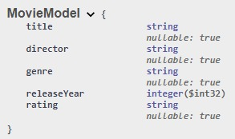

# PIA Backend

Integrantes del equipo:

Ricardo López Novelo

Humberto Gerardo Peña Páez

Miguel Alejandro Rodríguez Rocha

## Esquema

## Endpoint GET

Método GET

GET/api/Movie

Sin parametros

Request body:

No aplica

### Pruebas en postman

## Endpoint POST

Método POST

POST/api/Movie

Sin parametros

Request body:

{
  "title": "string",
  "director": "string",
  "genre": "string",
  "releaseYear": 0,
  "rating": "string"
}

### Pruebas en postman

## Endpoint PUT
Método PUT

PUT/api/Movie/{id}

Parametros: id (integer)

Request body:

{
  "title": "string",
  "director": "string",
  "genre": "string",
  "releaseYear": 0,
  "rating": "string"
}

### Pruebas en postman
Método DELETE

DELETE/api/Movie/{id}

Parametros: id (integer)

Request body:

No aplica

### Pruebas en postman
